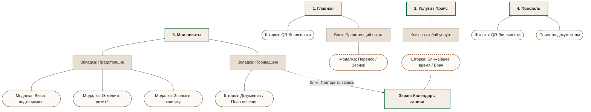

# 3M Clinic Premium — Структура экранов

```mermaid
flowchart TB
    classDef screen fill:#F4EFE6,stroke:#006039,stroke-width:2px,color:#2A2624,font-weight:bold;
    classDef modal fill:#FCFAF6,stroke:#9C5426,stroke-width:1px,color:#2A2624,stroke-dasharray: 4 4;
    classDef state fill:#E8DED1,stroke:#9E9892,stroke-width:1px,color:#2A2624;

    Home[1. Главная]:::screen
    Services[2. Услуги / Прайс]:::screen
    Visits[3. Мои визиты]:::screen
    Profile[4. Профиль]:::screen

    %% Главная Ветка
    Home --- H1([Шторка: QR Лояльности]):::modal
    Home --- H2[Блок: Предстоящий визит]:::state
    H2 --- H2a([Модалка: Перенос / Звонок]):::modal

    %% Услуги Ветка
    Services --- S1[Клик по любой услуге]:::state
    S1 --- S1a([Шторка: Ближайшее время / Врач]):::modal
    S1a --- Booking[Экран: Календарь записи]:::screen

    %% Визиты Ветка
    Visits --- V1[Вкладка: Предстоящие]:::state
    Visits --- V2[Вкладка: Прошедшие]:::state

    V1 --- V1a([Модалка: Визит подтвержден]):::modal
    V1 --- V1b([Модалка: Отменить визит?]):::modal
    V1 --- V1c([Модалка: Звонок в клинику]):::modal

    V2 --- V2a([Шторка: Документы / План лечения]):::modal
    V2 -. Клик: Повторить запись .-> Booking

    %% Профиль Ветка
    Profile --- P1([Шторка: QR Лояльности]):::modal
    Profile --- P2([Поиск по документам]):::modal

```